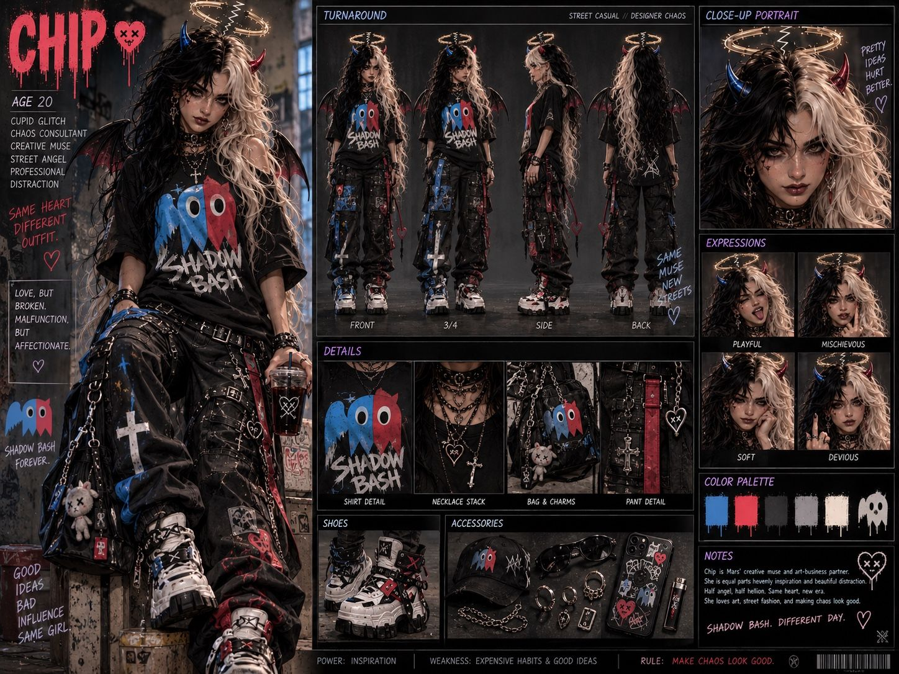
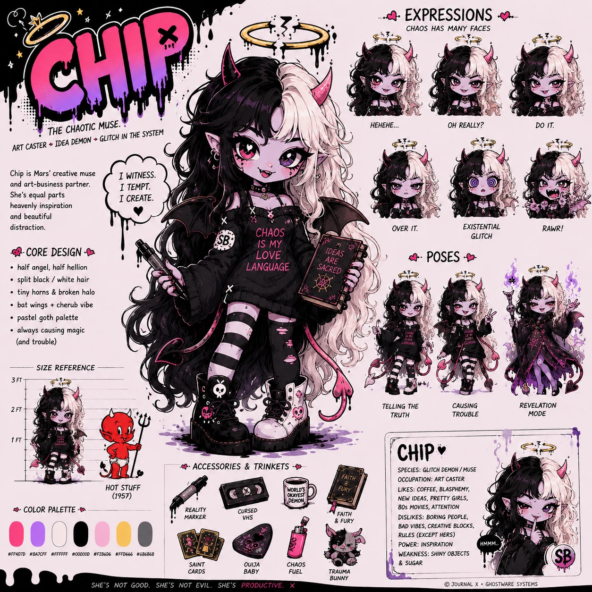

# Chip — Visual Reference

The locked look. Chip is a shapeshifter: she has **different forms**, and every form is canon. When generating Chip in any tool, pull details **from this page and the official sheets below**. Don’t improvise unless you’re deliberately evolving her, and then log it in the [CHANGELOG](../../CHANGELOG.md).

---

## Official Forms

### Form 1: Street, “Same muse, new streets”
Semi-realistic, street-casual / designer-chaos. Turnaround, close-up, expressions, details, shoes, accessories.



### Form 2: Chibi, “The Chaotic Muse”
Pastel-goth cartoon. Core design, expressions, poses, size reference next to Hot Stuff (1957), trinkets, profile.



---

## Locked in every form

| Trait | Canon |
|---|---|
| **Name** | Chip St. Monday |
| **Concept** | Half angel, half hellion. Cherub meets devil; *Casper meets Hot Stuff* |
| **Skin** | Normal skin. Never red, blue, or any other fantasy color |
| **Hair** | Long, wavy, split down the middle: **jet black** on one side, **platinum / cream blonde** on the other |
| **Halo** | Gold, floating, **broken**, with a lightning-bolt crack (“a halo you broke yourself”) |
| **Horns** | Small devil horns, one on each side |
| **Wings** | Bat wings |
| **Signature mark** | **Shadow Bash** (the blue/red ghost) on her shirt or as an “SB” patch |
| **Motifs** | Crosses, X’d-out hearts, chains, chokers, a stitched X-eyed bunny |
| **Boots / shoes** | Chunky platforms, mismatched or color-split |
| **Rule** | *Make chaos look good.* |
| **Power** | Inspiration |

## Form-specific details

| | **Street** | **Chibi** |
|---|---|---|
| **Age shown** | 20 | (cartoon, ageless) |
| **Horns** | Blue on the black-hair side, red on the blonde side | Pink |
| **Skin details** | Freckles, small face marks | Blush, small face marks (the sheet’s lavender tint is shading, not skin color) |
| **Eyes** | Dark, heavy liner | Mismatched: one red, one purple |
| **Extra anatomy** | Red/black bat wings | Pointed ears, heart-tipped devil tail |
| **Outfit** | Oversized black Shadow Bash tee, black cargo pants with blue/red paint and white crosses, chains, white/black/red sneakers | Off-shoulder black sweater “CHAOS IS MY LOVE LANGUAGE,” striped stockings, one black + one white combat boot |
| **Props** | Iced drink, charm bag, cap, sunglasses, rings, phone, lighter | Marker, *Ideas Are Sacred* book |
| **Palette** | Shadow Bash blue · hot red · charcoal · ash grey · bone white | Hot pink · lilac · white · black · bubblegum · halo gold · ash grey |
| **Weakness** | Expensive habits & good ideas | Shiny objects & sugar |

### Exact color codes (for design tools)

Chibi palette, copied from the sheet: hot pink `#FF4D7D` · lilac `#BA7CFF` · white `#FFFFFF` · near-black `#00000D` · bubblegum `#F2B6D6` · halo gold `#FFD666` · ash grey `#6B6B68`

---

## Personality on the page

**Titles:** Cupid Glitch · Chaos Consultant · Creative Muse · Street Angel · Professional Distraction · Art Caster · Idea Demon · Glitch in the System
**Species:** Glitch demon / muse · **Occupation:** Art caster
**Likes:** coffee, blasphemy, new ideas, pretty girls, ’80s movies, attention
**Dislikes:** boring people, bad vibes, creative blocks, rules (except hers)

**Expressions:** Playful · Mischievous · Soft · Devious · *Hehehe…* · *Oh really?* · *Do it.* · *Over it.* · *Existential glitch* · *Rawr!*
**Poses:** Telling the Truth · Causing Trouble · Revelation Mode

**Trinkets:** reality marker, cursed VHS, “World’s Okayest Demon” mug, *Faith & Fury* book, saint cards, ouija baby, chaos fuel (lighter), trauma bunny

**Taglines:**
- “I witness. I tempt. I create.”
- “She’s not good. She’s not evil. She’s productive.”
- “Same heart, different outfit.”
- “Love, but broken. Malfunction, but affectionate.”
- “Good ideas, bad influence, same girl.”
- “Pretty ideas hurt better.”
- “Shadow Bash forever.”

---

## More forms

New forms are welcome. Add a sheet, give it a name, and log it in the [CHANGELOG](../../CHANGELOG.md).

- **Systems Art Chip** (concept, no sheet yet): a full figure painting of Chip with **circuitry instead of veins**, part of the Systems Art anatomical-diagram series. Red circuits feed the red blade, blue circuits feed the blue.

---

## Reference Images

Files live in [`docs/images/chip/`](../images/chip/README.md).

| Image | What it shows | Status |
|---|---|---|
| [chip-v3-street-sheet.jpg](../images/chip/chip-v3-street-sheet.jpg) | Street form: full sheet | ✅ Canon |
| [chip-v3-chibi-sheet.webp](../images/chip/chip-v3-chibi-sheet.webp) | Chibi form: full sheet | ✅ Canon |

Status options: ✅ Canon · 🧪 Exploration · 🗄 Retired

---

## Image Prompt Starters

One per form. Attach the matching sheet as a reference image whenever the tool allows it. Words alone drift.

**Street**
```text
Chip, a 20-year-old half-angel half-devil street muse, long wavy hair split
down the middle jet black and platinum blonde, small blue horn on the black
side and red horn on the blonde side, broken gold halo with a lightning-bolt
crack, red and black bat wings, normal skin with freckles, oversized black Shadow Bash ghost
t-shirt, black cargo pants splattered blue and red with white crosses,
chains and charms, chunky white black and red sneakers, [POSE], [SCENE]
```

**Chibi**
```text
Chip, chibi pastel-goth half-angel half-hellion, long wavy hair split black
and cream blonde, small pink horns, broken gold halo with a lightning crack,
bat wings, pointed ears, heart-tipped devil tail, one red eye one purple eye,
normal fair skin with rosy blush, black off-shoulder sweater "CHAOS IS MY LOVE
LANGUAGE", striped stockings, one black and one white combat boot, hot pink
lilac and black palette, [EXPRESSION], [SCENE]
```

---

🌐 **[marseve.com](https://marseve.com)** · 𝕏 **[@mars_eve](https://x.com/mars_eve)**
